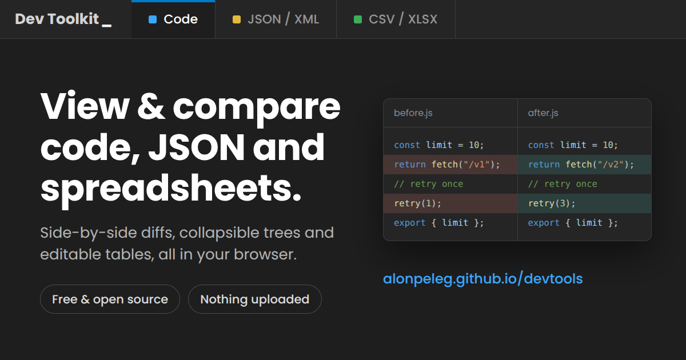
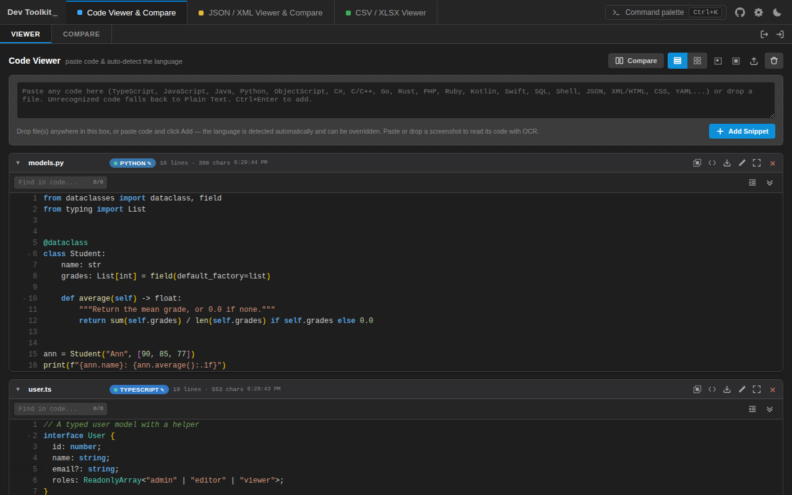
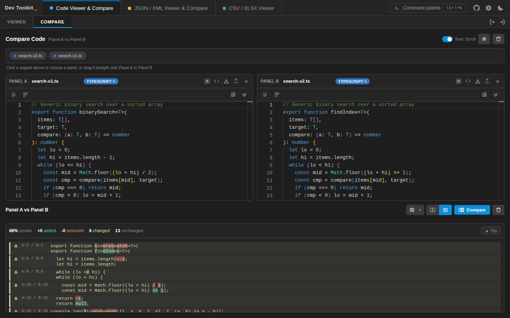
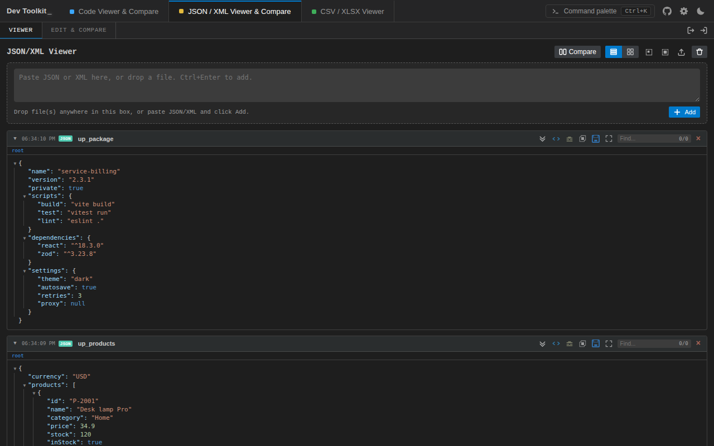
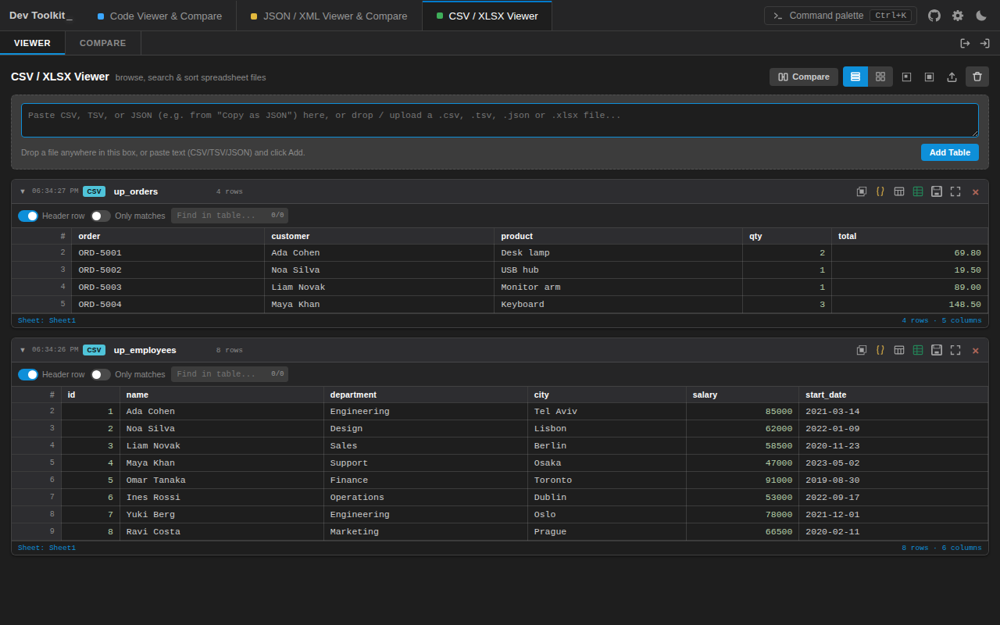
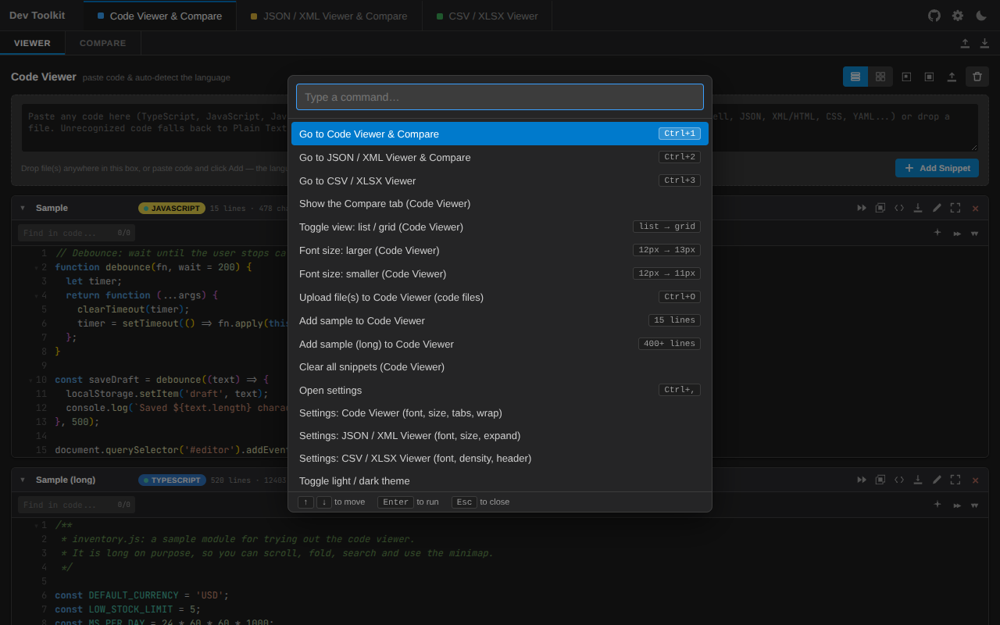
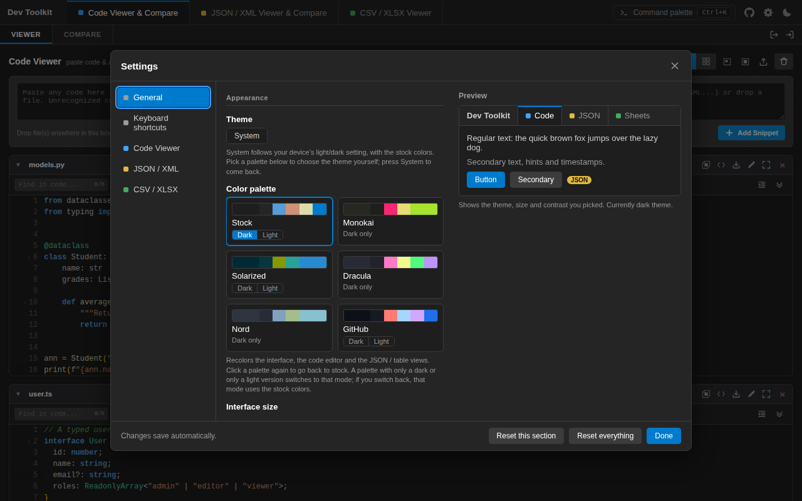
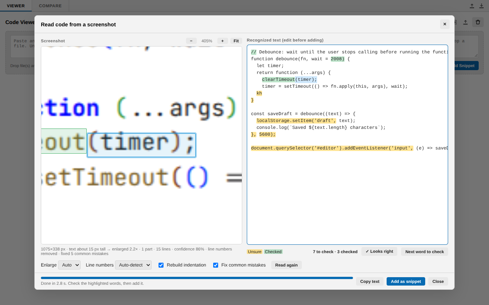
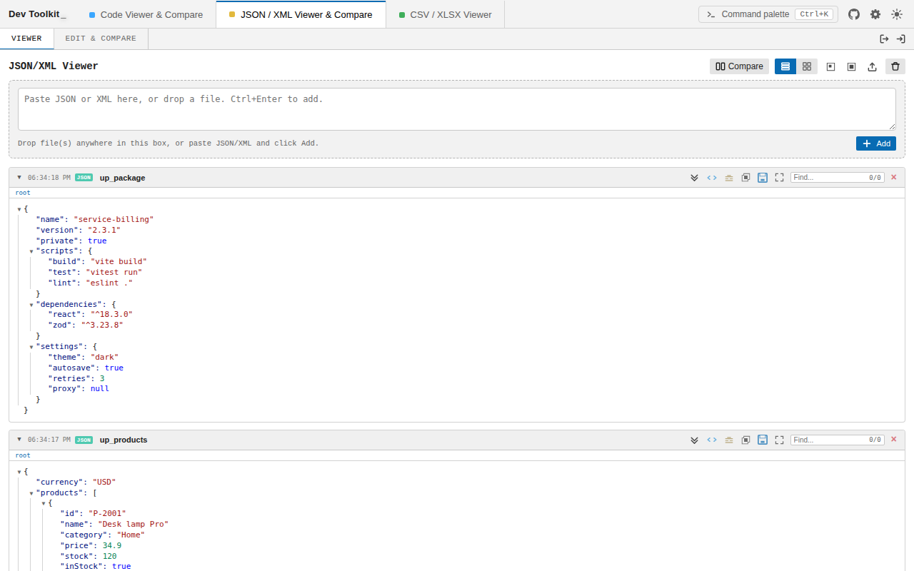

<h1 align="center">Dev Toolkit</h1>

<p align="center">
  <a href="https://alonpeleg.github.io/devtools/">
    <picture>
      <source media="(prefers-color-scheme: light)" srcset="og-image-light.png">
      
    </picture>
  </a>
</p>

<p align="center">
  <b>View and compare code, JSON/XML and CSV/XLSX files, side by side, right in your browser.</b><br>
  Free, open source, no sign-up, and your files never leave your device.
</p>

<p align="center">
  <a href="https://alonpeleg.github.io/devtools/"></a>
  
  
  
  <a href="LICENSE"></a>
</p>

<p align="center">
  <a href="https://alonpeleg.github.io/devtools/"><b>Open the app</b></a> ·
  <a href="#features">Features</a> ·
  <a href="#keyboard-shortcuts">Shortcuts</a> ·
  <a href="#command-palette-ctrlk">Command palette</a> ·
  <a href="#install-it-as-an-app">Install</a> ·
  <a href="#run-it-yourself">Run locally</a> ·
  <a href="#faq--troubleshooting">FAQ</a>
</p>

---

## Contents

- [What is it?](#what-is-it)
- [Features](#features)
  - [Code viewer and compare](#code-viewer-and-compare)
  - [JSON / XML viewer and compare](#json--xml-viewer-and-compare)
  - [CSV / XLSX viewer and compare](#csv--xlsx-viewer-and-compare)
  - [Across the whole toolkit](#across-the-whole-toolkit)
- [Screenshots](#screenshots)
- [Keyboard shortcuts](#keyboard-shortcuts)
- [Command palette (Ctrl+K)](#command-palette-ctrlk)
- [Settings](#settings)
- [Reading code from screenshots](#reading-code-from-screenshots)
- [Your data: privacy, storage and backups](#your-data-privacy-storage-and-backups)
- [Install it as an app](#install-it-as-an-app)
- [Run it yourself](#run-it-yourself)
- [Project structure](#project-structure)
- [How it works](#how-it-works)
- [Browser support and known limitations](#browser-support-and-known-limitations)
- [FAQ / troubleshooting](#faq--troubleshooting)
- [Ideas](#ideas)
- [Contributing](#contributing)
- [Third-party software](#third-party-software)
- [License](#license)

---

## What is it?

Dev Toolkit is three small viewers in one window. You paste or drop a file, and you get a readable, searchable view of it. Put two things next to each other in **Compare** and see exactly what changed.

| Tab | Handles | Compare tab |
|---|---|---|
| **Code Viewer & Compare** | Any source code, with the language detected for you | Two editors and a line-by-line diff |
| **JSON / XML Viewer & Compare** | JSON and XML as collapsible trees | Two editable panels and a structural diff |
| **CSV / XLSX Viewer** | CSV, TSV, JSON tables, and Excel workbooks | Two editable tables and a cell-level diff |

There is **nothing to install and nothing to sign up for**. It is a static website: open the page and use it. Everything you load stays in your browser.

## Try it

**<https://alonpeleg.github.io/devtools/>**

Open it, press <kbd>Ctrl</kbd>+<kbd>K</kbd>, type `add sample`, and press Enter to drop a sample into whichever tool you are on.

---

## Features

### Code viewer and compare

- Paste code, drop files, or upload several at once. The **language is detected automatically** (TypeScript, JavaScript, Java, Python, ObjectScript, C#, C/C++, Go, Rust, PHP, Ruby, Kotlin, Swift, SQL, Shell, JSON, XML/HTML, CSS, YAML and more) and you can override it. Anything unrecognized falls back to plain text.
- Syntax-highlighted snippets you can **fold**, **search** (with a match counter), **wrap**, view with a **minimap**, and open in a **focus view**.
- **Edit in place** with the Monaco editor (the editor that powers VS Code).
- **Read code from a screenshot (OCR).** Paste a screenshot (<kbd>Ctrl</kbd>+<kbd>V</kbd>), drop an image on the paste box, upload one, or run **Add code from a screenshot (OCR)** from the palette. Dev Toolkit enlarges small text automatically, splits a tall screenshot into parts, reads it in your browser, rebuilds the indentation and blank lines, and shows the result next to the image so you can fix it before adding it as a snippet. See [Reading code from screenshots](#reading-code-from-screenshots).
- Copy as raw text or as a Markdown code fence, or download the snippet as a file.
- **Stack or grid layout**, plus collapse or expand everything at once.
- **Compare** two snippets in two Monaco editors, with sync scroll, swap and reset:
  - A summary of what changed (similarity, added, removed, changed, unchanged).
  - **List or side-by-side** diff, with word-level highlights inside changed lines.
  - Options to ignore whitespace, case and blank lines.
  - Load a snippet into a panel from the chips above it, or drag it in.

### JSON / XML viewer and compare

- Paste, drop or upload **JSON or XML**; the format is detected for you.
- A **collapsible, colour-coded tree** with search, expand/collapse all, a minimap, and "copy path" from the right-click menu.
- **Smart auto-indent while you type** in the paste box: Enter keeps the indentation and indents after `{`, `[` or an opening XML tag; typing `}`, `]` or `</tag>` on its own line steps back one level. Pasting is never re-indented.
- **Edit & Compare** has two editable panels, each with an **Edit** mode and a **Tree** mode.
  - Format both panels, copy as formatted JSON, minified JSON or XML, save to a file, or send a panel back to the Viewer.
  - Compare shows a structural diff by path (`root.users.2.email`), as a list or side by side.

### CSV / XLSX viewer and compare

- Open **CSV, TSV, JSON tables and Excel files** (`.xlsx`, `.xls`) by paste, drop or upload. Workbooks with several sheets get a sheet selector.
- Sortable columns, **search** with an "only matches" filter, and a **header row** toggle.
- Copy or save a table as CSV, JSON, a Markdown table, or an `.xlsx` file.
- **Compare** two tables in editable panels:
  - Click a cell to edit it, add rows and columns, and use a formula bar.
  - A **cell-level diff** with added, removed and changed rows and columns.

### Across the whole toolkit

- **Command palette** for almost everything, with commands that depend on the tool and tab you are in.
- **Keyboard-first**: switch tools, flip between Viewer and Compare, upload, and open settings without touching the mouse.
- **Light, dark or system theme**, high-contrast mode, reduced-motion mode, and an interface size from 90% to 150%.
- **Per-tool settings** with a live preview: font, font size, line spacing, tab width, wrap, tree depth, row density and more.
- Four included programmer fonts (no download needed, and nothing is fetched until you pick one).
- **Your work is saved automatically** in your browser, with one-click backup and restore.
- **Installable** as a desktop app from Chrome or Edge.
- The top bar and dialogs adapt to narrow screens.

---

## Screenshots

<table>
  <tr>
    <td width="50%"><b>Code viewer</b><br></td>
    <td width="50%"><b>Compare (side by side)</b><br></td>
  </tr>
  <tr>
    <td><b>JSON / XML viewer</b><br></td>
    <td><b>CSV / XLSX viewer</b><br></td>
  </tr>
  <tr>
    <td><b>Command palette</b><br></td>
    <td><b>Settings with live preview</b><br></td>
  </tr>
  <tr>
    <td><b>Reading code from a screenshot (OCR)</b><br></td>
    <td><b>Light theme</b><br></td>
  </tr>
</table>

---

## Keyboard shortcuts

On macOS, use <kbd>⌘</kbd> instead of <kbd>Ctrl</kbd>. The palette button in the top bar shows the current palette shortcut.

**You can change the shortcuts, and give any command one:** the section lists every command, grouped as General, Tools, Current tool (acts on whichever tool is open: view toggle, font size, samples, OCR, clear), Appearance and Settings pages, with a filter box. Most start with no shortcut (“Not set”). open **Settings → Keyboard shortcuts**, click a shortcut (or double-click its row) and press the new combination (**Backspace** removes it). Every shortcut needs <kbd>Ctrl</kbd> (<kbd>⌘</kbd>) plus a key; a combination already in use, or kept for copy/paste/undo, is refused. **↺** restores one shortcut and **Reset this section** restores them all. The table below lists the defaults.

| Shortcut | What it does |
|---|---|
| <kbd>Ctrl</kbd>+<kbd>K</kbd> | Open the command palette |
| <kbd>Ctrl</kbd>+<kbd>Shift</kbd>+<kbd>P</kbd> | Open the palette while typing in the code editor (there, <kbd>Ctrl</kbd>+<kbd>K</kbd> belongs to Monaco) |
| <kbd>Ctrl</kbd>+<kbd>1</kbd> / <kbd>2</kbd> / <kbd>3</kbd> | Go to Code, JSON/XML or CSV/XLSX. The first press lands on that tool's **Viewer** with the cursor in the paste box. Press it **again** to flip to the **Compare** tab, and again to flip back |
| <kbd>Ctrl</kbd>+<kbd>O</kbd> | Upload files to the current tool |
| <kbd>Ctrl</kbd>+<kbd>V</kbd> | On the Code tab, pasting a screenshot from the clipboard starts OCR |
| <kbd>Ctrl</kbd>+<kbd>,</kbd> | Open settings |
| <kbd>Ctrl</kbd>+<kbd>Enter</kbd> | Add what is in the paste box |
| <kbd>Tab</kbd> / <kbd>Shift</kbd>+<kbd>Tab</kbd> | Indent or outdent in the paste boxes (multi-line selections work as a block). Press <kbd>Esc</kbd> then <kbd>Tab</kbd> to move on to the next control |
| <kbd>Esc</kbd> | Close a dialog |

**Command palette order.** At the top of **Settings → Keyboard shortcuts**, choose how the palette is arranged: **No sorting** (default: the palette’s original order), **By type** (settings first, then moving between tools, then commands for the tool you’re in, then appearance, settings pages and app commands, under small headings), **Alphabetical**, or **Custom**. With Custom, **Customize the palette…** opens a two-column editor: **All commands** (grouped by type) on the left, **Your palette** on the right. Click a command on the left to add it; click one on the right to send it back; drag in your palette (or use the arrows) to reorder. A new or empty custom palette shows just the essentials (keyboard shortcuts and the tab switchers). **Reset this section** restores No sorting.

Shortcuts use the physical key, so they also work with non-Latin keyboard layouts. Some browsers reserve <kbd>Ctrl</kbd>+number for switching browser tabs; if yours does, use the palette or click the tabs.

---

## Command palette (Ctrl+K)

Type to filter, use the arrow keys to move, and press Enter to run. The list changes with the tool and the sub-tab you are on.

**Always available**

- Go to Code, JSON/XML or CSV/XLSX
- Upload file(s) to the current tool (<kbd>Ctrl</kbd>+<kbd>O</kbd>)
- Open settings, or jump to one tool's settings
- Theme: follow system / dark / light / toggle
- Accessibility: high contrast, reduce animations
- Interface size: larger / smaller / reset
- Back up my data (export)
- Show keyboard shortcuts
- Install Dev Toolkit as an app (Chrome and Edge, when the browser offers it)
- Star Dev Toolkit on GitHub
- **Code tab only:** Add code from a screenshot (OCR)

**On a Viewer tab**

- Show the Compare tab
- Toggle view: list / grid
- Font size: larger / smaller / reset
- **Add sample** and **Add sample (long)**: a ready-made snippet, JSON object or table to play with. The long versions are about 500 lines of code, 400 JSON records, and 1,000 spreadsheet rows
- **Clear all** (asks for confirmation first)

**On a Compare tab**

- Show the Viewer tab
- Toggle view: compare results, list / side-by-side
- Font size: larger / smaller / reset
- **Clear all**: empties both panels and the results
- **Clear compare**: clears only the results area

---

## Settings

Open them with the gear icon, <kbd>Ctrl</kbd>+<kbd>,</kbd>, or the palette. Changes apply immediately and are saved automatically. Every section has a live preview.

| Section | Options |
|---|---|
| **General** | Theme (system / dark / light), interface size (90-150%), contrast, animations, welcome screen on/off (you can also switch it off right on the welcome screen with **Don’t show this page again**), install as an app, storage meter and "protect my data" |
| **Keyboard shortcuts** | Rebind or remove any shortcut and assign one to any palette command (per shortcut or all at once) |
| **Code Viewer** | Font, font size, line spacing, tab width, wrap long lines by default |
| **JSON / XML** | Font, font size, how many tree levels open by default |
| **CSV / XLSX** | Font, font size, row density, treat the first row as a header by default |

**Fonts.** JetBrains Mono, Fira Code, Source Code Pro and IBM Plex Mono are included in [`fonts/`](fonts) and work on any device. Cascadia Code, Consolas, Menlo and SF Mono are offered only if they are installed on your machine. With **Custom** you can name any installed font.

---

## Reading code from screenshots

The Code tab can turn a screenshot of code into text, entirely in your browser. The image is never uploaded.

**How to use it**

1. Take a screenshot of just the code (on Windows, <kbd>Win</kbd>+<kbd>Shift</kbd>+<kbd>S</kbd> lets you select the area).
2. On the **Code Viewer** tab, paste it (<kbd>Ctrl</kbd>+<kbd>V</kbd>), drop it on the paste box, or press <kbd>Ctrl</kbd>+<kbd>K</kbd> and run **Add code from a screenshot (OCR)**. Choosing an image with <kbd>Ctrl</kbd>+<kbd>O</kbd> also works.
3. Check the text on the right, fix anything wrong, and press **Add as snippet** (<kbd>Ctrl</kbd>+<kbd>Enter</kbd>). The language is detected as usual.

**What it does for you**

- **Enlarges small text.** It measures how tall the text is and enlarges the image (up to 4x) to the size the engine reads best.
- **Splits big screenshots.** A tall image is cut into parts only in the gaps between lines, each part is read on its own, and the results are joined.
- **Handles dark themes** by inverting them, and removes an IDE's **line-number column** (by its position, so numbers the engine misread as letters are removed too).
- **Ignores cut-off lines.** A line that is sliced through at the top or bottom edge of the screenshot is skipped instead of being read as garbage (the dialog tells you when it does this).
- **Fixes common mistakes** (you can turn this off). OCR engines are not built for code and reliably stumble on the same few things, so Dev Toolkit repairs those patterns: comment markers (`/**` and `*/` read as `[#=` or `=/`), the slashed or dotted zero read as `©`, template-string backticks, stray spaces (`numbers. reduce(`, `clearTimeout (x)`), ligature symbols such as `⇒` and `≡` (turned back into `=>` and `===`), and, in JavaScript-like code, the `=>` arrow read as `=`. Each rule only fires on a pattern that is almost never real code.
- **Highlights the words it is unsure about**, so you know where to look. In my tests the highlighted words were about 11% of the text but contained about 93% of the mistakes. Each one is also outlined on the screenshot.
- **Zoomable screenshot.** Zoom with the **+** / **-** buttons or <kbd>Ctrl</kbd> + mouse wheel, drag to move around, and **Fit** to see it all. **Next word to check** (<kbd>F8</kbd>) jumps to the next uncertain word and zooms the screenshot to it, so you can compare the two at a glance. Clicking a word in the text, or its box on the screenshot, does the same.
- **Mark words as checked.** If a highlighted word is right, press **Looks right** (<kbd>F9</kbd>). It turns green, the counter goes down ("7 to check, 3 checked"), and you move on to the next one. Fixing a word (editing its line) removes its highlight.
- **Rebuilds indentation and blank lines** from where each line sits in the image.
- The dialog shows what it did (text size, enlargement, number of parts, confidence) and lets you change the enlargement, line-number handling and indentation, then **Read again**.
- Several images queue up, and you can cancel at any time.

**The first use downloads about 7 MB** (the OCR engine and its English model) from the jsDelivr CDN. The browser keeps it, so later uses are instant, and nothing is downloaded at all unless you use this feature.

**How good is it?** On clean, computer-made screenshots it gets roughly 98-99% of characters right, even for text only 9 px tall, for full-HD and 4K screenshots, and with line numbers. Blurry or heavily compressed images do worse (about 97% in testing). That is still an occasional wrong character, so **read through the result, starting with the highlighted words**. Typical remaining mistakes are `0` read as `8` or `6`, a dropped `;` at the end of a line, and `===` read as `==`.

**Limits**

- **Crop to the code first.** Sidebars, tab bars and status bars in the screenshot are read as text too, and there is no crop tool yet.
- **Ligature fonts** (which draw `=>` as a single arrow and `===` as three bars) and **italic comments** are harder to read. If you can, turn ligatures off in your editor before taking the screenshot.
- English text only, and one column of **monospace** code (indentation is rebuilt from character widths).
- Photos of a screen, handwriting and tables are not what it is built for.
- It runs on your device, so a large screenshot can take a few seconds.

---

## Your data: privacy, storage and backups

**Your files never leave your browser.** Dev Toolkit has no server, no account, no analytics and no tracking. Parsing, diffing and rendering all happen on your device.

Two libraries are loaded from public CDNs when the page opens, so those two hosts can see your IP address like any website you visit: the Monaco editor (jsDelivr) and the Excel reader SheetJS (cdnjs). Your data is never sent to them. The OCR engine (about 7 MB) is only fetched from jsDelivr the first time you use OCR, and the screenshot itself never leaves your device.

**Saved automatically.** Snippets, JSON entries and tables you add are stored in your browser's **IndexedDB** (database `dev_toolkit_v1`), one record per item, so saving is fast and large files are fine. Settings and a few small preferences are in `localStorage` (`dev_toolkit_settings_v1`, `dev_toolkit_last_tab_v1`, and layout choices).

**Backups.** Each tool has **export** and **import** icons in the top-right corner. An export is a single JSON file with all three tools' data and your settings. Importing overwrites matching data and reloads the page. Backups made by earlier versions still import.

**Good to know**

- Data belongs to the browser profile and web address it was saved under. Chrome, Edge and other profiles each have their own copy.
- Clearing the site's data in your browser, or using a private/incognito window, removes it. Export a backup now and then.
- **Settings → General → "Protect my data from auto-cleanup"** asks the browser not to evict it when the device runs low on space (browsers may decline).
- If a save ever fails (for example, storage is full or blocked), a visible warning appears with an **Export backup** button. Your work is still on screen.

---

## Install it as an app

In **Chrome or Edge** you can install Dev Toolkit so it opens in its own window, without browser tabs:

- click the install icon at the right end of the address bar, or
- use **Settings → General → App → Install Dev Toolkit**, or
- press <kbd>Ctrl</kbd>+<kbd>K</kbd> and run **Install Dev Toolkit as an app**.

An installed app is the same website in its own window, so **everything works exactly the same**. It shares its saved data with the website in that browser profile.

- **Safari on Mac:** File → Add to Dock. The Dock app keeps its own copy of the data, so export and import once.
- **Firefox on desktop** cannot install web apps. Use it as a normal website.
- Installing needs the site served over `https://` or `http://localhost`. It is not offered when a page is opened straight from a file, in a private window, or once it is already installed.

The app's service worker ([`sw.js`](sw.js)) exists only so browsers offer to install. It **caches nothing**, so it can never show you a stale page.

---

## Run it yourself

There is no build step, no package manager and no dependencies to install. It is plain HTML, CSS and JavaScript.

**Locally**

```bash
git clone https://github.com/AlonPeleg/devtools.git
cd devtools

# any static file server works, for example:
python -m http.server 8000      # Windows: py -m http.server 8000
# or
npx serve
```

Then open <http://localhost:8000>.

You can also just double-click `index.html`. Almost everything works from a file, but the install option and the service worker need `http://localhost` or `https://`.

**Host your own copy on GitHub Pages**

1. Fork this repository.
2. In your fork, go to **Settings → Pages**.
3. Under **Build and deployment**, choose **Deploy from a branch**, pick `main` and `/ (root)`, and save.
4. After a minute your copy is live at `https://<your-username>.github.io/devtools/`.

All paths in the project are relative, so it works from a sub-folder as well as from a domain root. The link-preview tags in `index.html` (`og:image`, `canonical` and the JSON-LD block) point at `https://alonpeleg.github.io/devtools/`; change them if you host it elsewhere.

---

## Project structure

```
devtools/
├── index.html              The shell: tabs, command palette, settings, welcome screen, install
├── code.html               Code Viewer & Compare
├── json.html               JSON / XML Viewer & Compare
├── xlsx.html               CSV / XLSX Viewer & Compare
├── manifest.json           Web app manifest (name, colours, icons) for "Install app"
├── sw.js                   Tiny service worker that only enables installing; caches nothing
├── fonts/                  Included fonts (.woff2) and their licenses
├── docs/                   Screenshots used in this README
├── favicon.svg / .ico      Browser-tab icon
├── apple-touch-icon.png    iPhone / iPad home-screen icon
├── icon-192.png, icon-512.png, icon-maskable-512.png   App icons
├── og-image.png            Link preview and welcome screen (dark)
├── og-image-light.png      Welcome screen (light)
└── LICENSE
```

## How it works

`index.html` is a thin **shell**. Each tool is a separate, self-contained page that the shell loads into its own `<iframe>` the first time you open its tab.

- **Talking to the tools.** The shell and the tool pages exchange `postMessage` messages (all prefixed `__devToolkit`). The shell sends theme, settings and commands; the tools report their state (for example, which sub-tab is showing) and forward shortcut keys. When the pages share an origin, the shell also listens for keys and calls tool functions directly, so it keeps working even if a tool page is out of date.
- **A small runtime in every tool page** (`window.DT`) applies the settings as CSS variables, forwards shortcuts, and exposes the hooks the palette uses (clear, toggle view, upload, add sample).
- **Storage.** A small IndexedDB layer in each tool page saves one record per item, writes only what changed, and never blocks the UI. It shows a visible warning if a write fails, and it migrates data from the older `localStorage` format automatically.
- **Settings** live in one `localStorage` key, read by the tool pages before they first paint, so there is no flash of the wrong theme.
- **Page versions.** The shell loads each tool with a `?v=<build>` suffix so a browser can never pair a new shell with an old cached tool page. If a tool page does not answer at all, a notice explains what to re-upload.
- **Scaling.** "Interface size" scales the tool frames like browser zoom (a CSS transform on the iframe), so the tool pages need no changes for it.

---

## Browser support and known limitations

- **Best in Chrome and Edge** (desktop): that is what it is developed and tested in. Firefox and Safari work as normal websites but have had less testing.
- **Needs an internet connection to load.** Nothing is cached for offline use, and Monaco and SheetJS come from CDNs. Once the page has loaded, it keeps working until you reload.
- **Very large inputs are slow.** The table viewer draws every row, so sheets with tens of thousands of rows take a while and use a lot of memory (about 2 seconds for 20,000 rows in testing). Very large code files render at roughly a second per megabyte.
- **OCR is not perfect** and is limited to English, monospace code in a screenshot cropped to the code (see [above](#reading-code-from-screenshots)).
- <kbd>Ctrl</kbd>+number may be reserved by some browsers. Use the palette or the tabs in that case.
- <kbd>Ctrl</kbd>+<kbd>O</kbd> is taken over for uploading on this page, replacing the browser's own "open file".

---

## FAQ / troubleshooting

<details>
<summary><b>I updated the files but the site looks the same.</b></summary>

Browsers and GitHub Pages cache files for a few minutes. Wait a minute or two, then hard-refresh with <kbd>Ctrl</kbd>+<kbd>Shift</kbd>+<kbd>R</kbd> (<kbd>⌘</kbd>+<kbd>Shift</kbd>+<kbd>R</kbd> on Mac).
</details>

<details>
<summary><b>A red "Some Dev Toolkit files are out of date" notice appears.</b></summary>

One of the tool pages did not respond to the shell, which usually means an old copy is being used. Make sure `index.html`, `code.html`, `json.html` and `xlsx.html` were all uploaded together, then hard-refresh.
</details>

<details>
<summary><b>There is no "Install" button.</b></summary>

It only appears in Chrome and Edge, over `https://` or `localhost`, outside private windows, and when the app is not already installed. It does not appear for a page opened from a file. You can also look for an **Install** entry in the browser's own menu.
</details>

<details>
<summary><b>My mouse pointer disappears when I type in the command palette.</b></summary>

That is your operating system's "hide pointer while typing" feature, and a web page cannot turn it off. When you need the file dialog with the pointer visible, press <kbd>Ctrl</kbd>+<kbd>O</kbd> instead of typing "upload". You can also switch the feature off. On Windows: Settings → Bluetooth & devices → Mouse → Additional mouse settings → Pointer Options → untick **Hide pointer while typing**.
</details>

<details>
<summary><b>My saved snippets disappeared.</b></summary>

Saved data is tied to the browser profile and the site address. Check that you are in the same browser and profile, and that the site's data was not cleared or you are not in a private window. Import a backup file if you have one.
</details>

<details>
<summary><b>The OCR result has mistakes.</b></summary>

That is expected: OCR engines are not built for code, so `0`/`8`, `l`/`1` and punctuation get mixed up now and then. Use a sharper or larger screenshot, crop to just the code, try a different **Enlarge** setting and press **Read again**, and always review the text before adding it.
</details>

<details>
<summary><b>Does it work offline?</b></summary>

Not yet. The page needs a connection to load (and Monaco and SheetJS come from CDNs, and OCR downloads its engine on first use). After it has loaded, it keeps working until you reload. Bundling everything for full offline use is on the [ideas](#ideas) list.
</details>

---

## Ideas

Not promises, just things that would fit:

- OCR for the JSON/XML tab, a crop tool for screenshots, and more languages
- Bundle Monaco and SheetJS so the app works fully **offline**
- JSONPath queries, JSON ↔ YAML/CSV conversion, and TypeScript type generation
- Shareable links for small snippets
- Column statistics and quick charts for tables
- A "Utilities" tab (Base64, JWT decoder, timestamps, regex tester)
- More palette commands (Compare now, Swap panels, and others)

## Contributing

Issues and pull requests are welcome, whether it is a bug report, a small fix or an idea.

- There is nothing to build: edit the HTML, serve the folder (see [Run it yourself](#run-it-yourself)) and reload.
- Each tool page is self-contained; the shell talks to them only through the messages described in [How it works](#how-it-works).
- Please try a change in Chrome or Edge, and if you can, in Firefox or Safari as well.
- For bugs, please say which browser and operating system you use, and what you did.

## Third-party software

| Component | Use | License |
|---|---|---|
| [Monaco Editor](https://github.com/microsoft/monaco-editor) 0.45.0 | Code editing (loaded from jsDelivr) | MIT |
| [SheetJS Community Edition](https://sheetjs.com/) 0.18.5 | Reading Excel files (loaded from cdnjs) | Apache-2.0 |
| [JetBrains Mono](https://github.com/JetBrains/JetBrainsMono), [Fira Code](https://github.com/tonsky/FiraCode), [Source Code Pro](https://github.com/adobe-fonts/source-code-pro), [IBM Plex Mono](https://github.com/IBM/plex) | Included fonts, in [`fonts/`](fonts) | SIL Open Font License 1.1 (see the license files there) |
| [Tesseract.js](https://github.com/naptha/tesseract.js) 7.0.0, tesseract.js-core and the English language data | Reading text from screenshots (loaded from jsDelivr only when OCR is used) | Apache-2.0 |
| [Octicons](https://github.com/primer/octicons) | The GitHub mark in the top bar | MIT |

## License

Dev Toolkit is released under the [MIT License](LICENSE).

## Author

Made by [Alon Peleg](https://github.com/AlonPeleg). If it saves you time, a ⭐ on the repository is appreciated.
